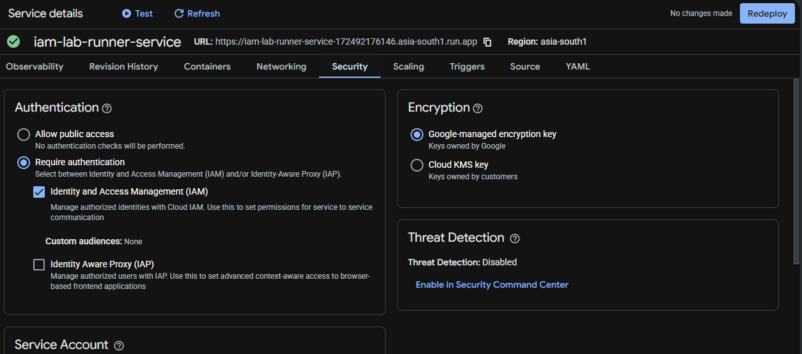
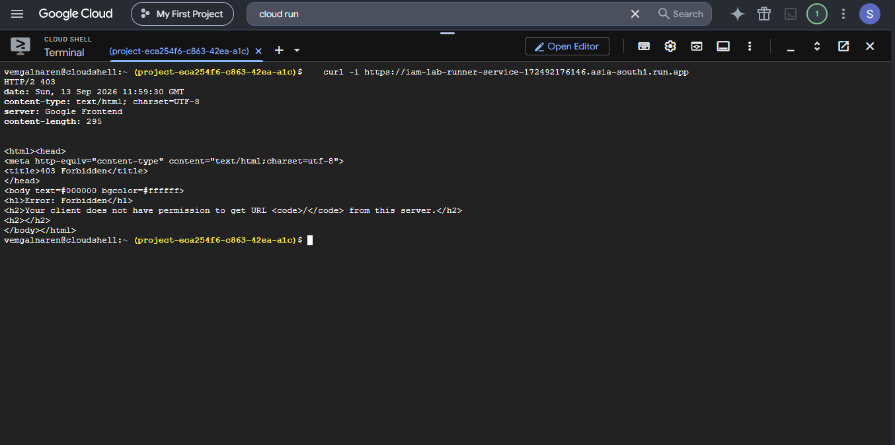
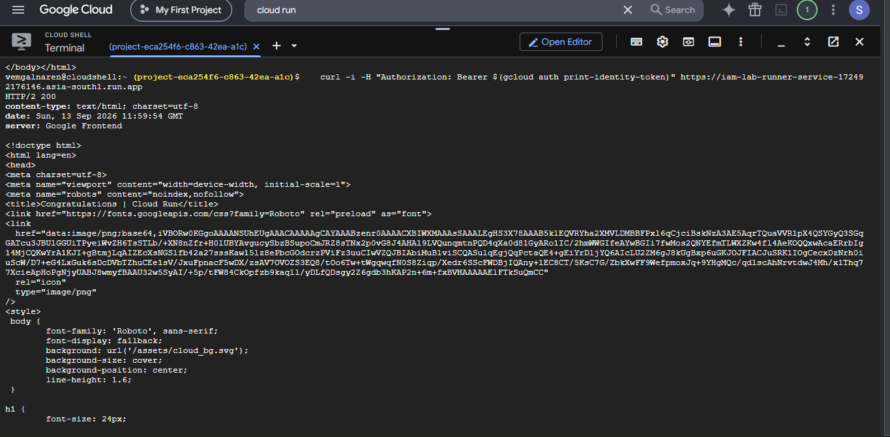
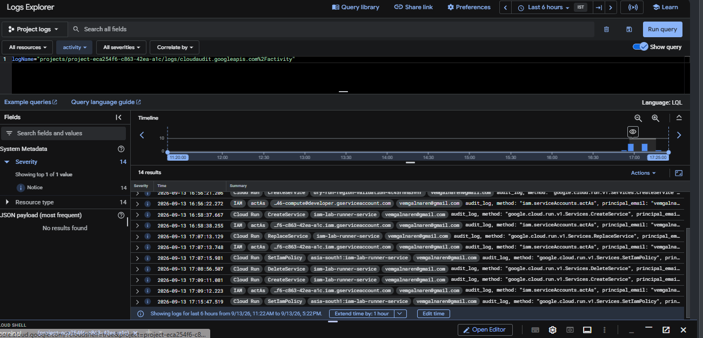

# GCP Compute Least-Privilege Lab (Cloud Run)

A hands-on project demonstrating least-privilege access control applied to **compute**, not just storage — deploying a Cloud Run service under a dedicated service account, locking down public access, and proving the restriction with real, reproducible requests. This README explains the *why* behind each step, plus a real debugging story that came up mid-project (left in deliberately, since working through a misconfiguration is a normal and valuable part of learning cloud infrastructure).

---

## 1. The Problem This Project Solves

Chapter 1 of this learning series proved least-privilege access control on **Cloud Storage** — a passive resource that only responds to requests. This project asks the same question about **compute** — an active resource that runs code and can be triggered by anyone, unless explicitly restricted:

> "How do you deploy a running service in the cloud so that only specifically authorized identities can call it — and how do you *prove* that restriction is actually enforced, not just configured?"

---

## 2. What Was Built (High-Level Summary)

1. A dedicated service account, `cloudrun-lab-runner`, created with no permissions by default — the same pattern used for `iam-lab-reader` in the IAM project.
2. A Cloud Run service (`iam-lab-runner-service`) deployed using Google's public sample container, running **as** that dedicated service account instead of the project's default one.
3. The service was configured to **require authentication** — meaning it should reject any request that doesn't come from an explicitly authorized identity.
4. This restriction was verified with real HTTP requests: an unauthenticated request should get **403 Forbidden**, and a request carrying a valid identity token from an authorized user should get **200 OK**.
5. Along the way, a real misconfiguration was discovered and fixed (see Section 4 below) — the service was initially still reachable publicly despite being set to "require authentication," due to a sticky internal annotation from how it was first deployed.
6. The service's behavior of automatically scaling down to **zero running instances** when idle (and back up on the next request) was observed directly.
7. Every action — deployment, the misconfiguration, the fix, and the access grant — was confirmed in **Cloud Audit Logs**.

---

## 3. Key Concepts Explained (For Beginners)

| Concept | Plain-English Explanation |
|---|---|
| **Cloud Run** | A way to run a containerized application without managing any servers — you give it a container, it runs it, and automatically scales it up or down (including to zero) based on traffic. |
| **Service Account (for compute)** | Just like a storage-reading identity from Chapter 1, a compute workload also runs *as* an identity. That identity's permissions determine what the running service can do or access elsewhere in GCP. |
| **Require Authentication** | A setting that means requests must prove who they are (via a Google-issued identity token) before Cloud Run will even run your code for them — as opposed to allowing anyone on the internet to call it. |
| **IAM Invoker Role** | The specific permission (`roles/run.invoker`) that controls *who is allowed to trigger/call* a Cloud Run service — separate from what the service itself is allowed to do once running. |
| **Scale to Zero** | When there's no traffic, Cloud Run shuts down all running copies of your service completely — you pay nothing while idle. |
| **Cold Start** | The small delay when a request arrives after scaling to zero, while Cloud Run spins up a fresh instance to handle it. |

---

## 4. Step-by-Step Walkthrough (Including the Real Debugging Story)

### Step 1 — Enable the Cloud Run API
A one-time setup step so the project can use Cloud Run at all.

### Step 2 — Create a dedicated service account
`cloudrun-lab-runner` was created with **zero** roles granted at creation — following the exact same reasoning as Chapter 1: don't assume a workload needs broad access; grant only what it turns out to need, and only once you know what that is.

### Step 3 — Deploy the service
The service was deployed using Google's public `gcr.io/cloudrun/hello` sample image (no custom code needed for this project — the focus is access control, not application logic), configured to run as `cloudrun-lab-runner`, with "Require authentication" selected.

### Step 4 — The unexpected problem: public access wasn't actually blocked
This is the part worth explaining honestly, because it's a realistic example of how cloud misconfigurations happen even when you follow the steps correctly.

**What was expected:** an unauthenticated request to the service's URL should return `403 Forbidden`.

**What actually happened:** the request returned `200 OK` — the service was reachable by anyone, despite "Require authentication" being selected during deployment.

**Root cause, found by inspecting the service's metadata directly:**
```bash
gcloud run services describe iam-lab-runner-service --region=asia-south1 --format="value(metadata.annotations)"
```
This revealed an internal annotation:
```
run.googleapis.com/invoker-iam-disabled=true
```
This annotation tells Cloud Run to **skip the IAM invoker check entirely** — meaning it doesn't matter what the IAM policy says, the service will respond to anyone. This flag had been set during the very first deployment (before some settings were adjusted), and — importantly — **updating the existing service afterward did not clear it**, even using `gcloud run services update` and `gcloud run deploy` with the correct flags.

**The fix:** the service had to be **deleted and recreated from scratch** with the correct settings from the very first deploy:
```bash
gcloud run services delete iam-lab-runner-service --region=asia-south1 --quiet

gcloud run deploy iam-lab-runner-service \
  --image=gcr.io/cloudrun/hello \
  --region=asia-south1 \
  --service-account=cloudrun-lab-runner@<PROJECT_ID>.iam.gserviceaccount.com \
  --no-allow-unauthenticated
```
After recreating it, the same unauthenticated request correctly returned `403 Forbidden`.

**Why this is worth including in the writeup:** a real skill in cloud engineering isn't just "follow the steps and get the expected result" — it's noticing when the actual behavior doesn't match the expected behavior, knowing where to look (`describe` and inspecting raw metadata/annotations, not just the console UI) to find out why, and understanding that some settings are only fully applied at creation time rather than through an update.

### Step 5 — Grant invoker access and confirm both sides of the restriction
1. `curl` without any credentials → confirmed **403 Forbidden**.
2. Granted the calling user the `roles/run.invoker` role, scoped to this one service.
3. `curl` again, this time with `Authorization: Bearer $(gcloud auth print-identity-token)` → confirmed **200 OK**.

This proves the restriction works in both directions — denying by default, and allowing only once explicitly granted.

### Step 6 — Observe scale-to-zero and cold start
After a period with no requests, the service's **Container instance count** metric dropped to zero. Sending one more authenticated request afterward triggered a brief delay (a cold start) while a new instance was created to handle it, then returned successfully.

### Step 7 — Confirm the full trail in Cloud Audit Logs
Querying Cloud Logging's Logs Explorer for `cloudaudit.googleapis.com%2Factivity` surfaced the entire sequence as real, timestamped entries — including the original `CreateService`, the failed update attempt (`ReplaceService`), the `DeleteService`, the corrected `CreateService`, and the `SetIamPolicy` call that granted invoker access. Every action was attributed to the correct principal and method name, exactly as the Chapter 1 IAM theory described.

---

## 5. Commands Used

```bash
# Deploy the service correctly, from scratch, in one step
gcloud run deploy iam-lab-runner-service \
  --image=gcr.io/cloudrun/hello \
  --region=asia-south1 \
  --service-account=cloudrun-lab-runner@<PROJECT_ID>.iam.gserviceaccount.com \
  --no-allow-unauthenticated

# Confirm unauthenticated access is blocked
curl -i https://<YOUR_SERVICE_URL>

# Grant a specific user permission to invoke the service
gcloud run services add-iam-policy-binding iam-lab-runner-service \
  --region=asia-south1 \
  --member="user:<your-email>" \
  --role="roles/run.invoker"

# Confirm authenticated access now works
curl -i -H "Authorization: Bearer $(gcloud auth print-identity-token)" https://<YOUR_SERVICE_URL>

# Inspect metadata directly when the console doesn't explain unexpected behavior
gcloud run services describe iam-lab-runner-service --region=asia-south1 --format="value(metadata.annotations)"
```

---

## 6. Screenshots

| Service Security Tab (dedicated service account) | Unauthenticated Request (403) | Authenticated Request (200) | Audit Log Trail |
|---|---|---|---|
|  |  |  |  |

---

## 7. What This Project Proves

- Least-privilege access control applies to compute exactly the same way it applies to storage: deny by default, grant narrowly, verify with a real denied and a real allowed request.
- Cloud configuration doesn't always behave as expected on the first attempt — some settings are sticky at creation time and don't clear on update, which is a genuinely common real-world cloud debugging pattern, not a mistake unique to this project.
- Every access-relevant action, whether it went right the first time or not, is fully traceable afterward in Cloud Audit Logs.

---

## 8. Next in This Learning Series

- **Chapter 3 — Storage & Databases:** connecting a compute workload like this one to an actual database or bucket, using the same least-privilege identity pattern established across Chapters 1 and 2.
